# Loss-Tolerant Topological Quantum Error Correction

### KIST Research Internship — Toric/Surface-Code Simulation with Weighted Dijkstra + MWPM

This repository documents a research implementation developed during my KIST research internship. The project studies **topological quantum error correction under detectable qubit loss** and reconstructs the loss-aware decoding pipeline described in the surface-code literature as an executable Monte Carlo simulator.

The central implementation idea is to transform a lattice damaged by known qubit losses into a **superplaquette graph**, compute probability-aware shortest paths on that irregular graph with **Dijkstra's algorithm**, pair syndrome defects with **minimum-weight perfect matching (MWPM)**, restore the selected paths to physical-qubit corrections, and finally determine logical failure from the homology class of the combined error and correction chains.

> **Scope note.** The numerical implementation in `loss_tolerant_surface_code.ipynb` uses a periodic square lattice, i.e. a **toric-code geometry**, as a boundary-free testbed for the loss-tolerant surface-code decoding mechanism. This repository is an implementation/reproduction study and does **not** claim that superplaquettes, Dijkstra shortest paths, or MWPM are newly invented decoding concepts.

---

## 한국어 요약

이 프로젝트에서는 **qubit loss가 발생하는 topological quantum error correction 환경**을 공부하고, loss가 발생한 뒤 기존 lattice의 연결 구조가 바뀌는 문제를 graph decoding 문제로 다시 구성했습니다.

핵심은 다음과 같습니다.

1. `p_loss` 확률로 **detectable qubit loss**를 발생시킵니다.
2. loss된 data-qubit edge를 기준으로 인접 plaquette를 합쳐 **superplaquette**를 구성합니다.
3. 서로 이웃한 superplaquette 사이에 남아 있는 physical qubit의 개수에 따라 effective error probability와 log-likelihood weight를 계산합니다.
4. loss 때문에 불규칙해진 weighted graph에서 **Dijkstra algorithm**으로 syndrome defect 사이의 minimum-cost path를 구합니다.
5. defect complete graph에 **MWPM**을 적용해 가장 가능성이 높은 correction pairing을 찾습니다.
6. 선택된 path를 실제 physical correction chain으로 복원하고 **homology**를 검사해 logical failure 여부를 판정합니다.
7. `L = 16, 24, 32` lattice에서 Monte Carlo simulation과 finite-size crossing을 수행해 `p_loss`에 따른 computational-error threshold 변화를 측정합니다.

현재 repository에 저장된 실행 결과에서는 `p_loss = 0`에서 약 **10.3%**의 threshold를 재현했고, `p_loss = 0.425`의 high-loss regime에서는 유효한 `L=24`–`L=32` finite-size crossing이 **`p_comp ≈ 0.022014` (약 2.20%)**로 나타납니다. 다만 이 영역은 reference paper에서도 finite-size percolation effect 때문에 universal scaling이 무너지는 구간이므로, 이 값은 **asymptotic fault-tolerance threshold가 아니라 현재 lattice size에서의 finite-size estimate**로 해석해야 합니다.

---

## 1. Research Question

A surface/toric code can correct computational errors by identifying syndrome defects and inferring a likely error chain. But what happens if some of the physical qubits themselves are **lost**?

In this project, a lost qubit is treated as a **known erasure**: its location is available to the decoder, but the qubit can no longer be used as an ordinary lattice edge. This changes the topology of the decoding graph.

The main question is therefore:

> **How should the decoding graph and shortest-path metric be reconstructed after detectable qubit losses, and how does the tolerable computational-error rate change as the loss rate increases?**

The simulation distinguishes three probabilities/observables:

- `p_loss` — probability that a data-qubit edge is lost and its location is known.
- `p_comp` — probability of an `X` computational error on a surviving data qubit.
- `p_fail` — logical-`X` failure probability after loss-aware decoding.

Computational errors are sampled **only on surviving edges**, so the loss mask and the `X`-error mask do not overlap.

---

## 2. What I Studied

The implementation was built after studying the following concepts in sequence.

### 2.1 Stabilizer and topological quantum error correction

The starting point is the stabilizer description of the toric/surface code:

- physical data qubits on lattice edges,
- plaquette/star stabilizers,
- syndrome defects as boundaries of error chains,
- logical operators as non-contractible/topologically non-trivial chains,
- correction success or failure determined by the homology of the combined error and correction chains.

### 2.2 Detectable qubit loss

When the location of a lost data qubit is known, the stabilizers touching that qubit can no longer be treated independently in the original way. Adjacent plaquettes are merged into larger effective checks called **superplaquettes**.

This converts the original regular square lattice into an **irregular degraded graph** whose edge structure depends on the sampled loss pattern.

### 2.3 Loss percolation

For a square-lattice topological code, the fundamental detectable-loss limit is connected to the bond-percolation threshold. In the infinite-lattice limit, the known loss threshold reaches `p_loss = 0.5`.

Near this point, however, a finite lattice can contain a superplaquette whose size is already comparable to the system size. This makes finite-size effects especially important around `p_loss ≳ 0.425` for the `L ≤ 32` lattices used in the reference study and in this reproduction.

### 2.4 MWPM decoding

A syndrome gives a set of defect nodes. The decoder must connect defects in pairs using likely correction chains. This is formulated as a **minimum-weight perfect matching (MWPM)** problem.

The nontrivial part in the loss-aware case is calculating a physically meaningful pairwise path cost after the lattice has been deformed by losses.

---

## 3. Core Idea: Rebuild the Decoder After Loss

The full pipeline is:

```mermaid
flowchart LR
    A[Periodic toric lattice] --> B[Sample known qubit loss]
    B --> C[Merge plaquettes into superplaquettes]
    C --> D[Build weighted degraded graph]
    D --> E[Dijkstra shortest paths]
    E --> F[Metric closure of syndrome defects]
    F --> G[MWPM defect pairing]
    G --> H[Restore physical correction chain]
    H --> I[Homology / logical-failure test]
    I --> J[Monte Carlo threshold analysis]
```



### Why Dijkstra?

Without loss and with a uniform independent error probability, every physical edge has the same log-likelihood cost. In that special case, geometric shortest-path distance is sufficient.

After loss, this is no longer true:

- several surviving physical qubits can connect the same pair of neighboring superplaquettes,
- different superedges therefore have different effective error probabilities,
- a path with fewer graph hops is not necessarily the most likely path.

The decoder therefore needs a **weighted shortest-path algorithm** rather than a fixed geometric distance. Dijkstra's algorithm is used to minimize the accumulated likelihood cost on the degraded graph.

---

## 4. Effective Superedge Probability

Suppose two neighboring superplaquettes share `n_ℓ` surviving physical edges. A non-trivial syndrome across that interface occurs when an **odd** number of those physical qubits has an `X` error.

For an independent computational-error probability `p_comp`, the effective odd-error probability is

\[
p_\ell
= \sum_{m\;\mathrm{odd}}
\binom{n_\ell}{m}
 p_{\mathrm{comp}}^m
 (1-p_{\mathrm{comp}})^{n_\ell-m}
= \frac{1-(1-2p_{\mathrm{comp}})^{n_\ell}}{2}.
\]

The corresponding log-likelihood weight is

\[
w_\ell = \log\left(\frac{1-p_\ell}{p_\ell}\right).
\]

For two syndrome defects `u` and `v`, Dijkstra computes

\[
d(u,v)=\min_{\gamma:u\rightarrow v}\sum_{\ell\in\gamma} w_\ell.
\]

These pairwise distances define the weighted complete graph supplied to MWPM.

This is important because the decoder is minimizing a **probabilistic cost**, not merely Euclidean or Manhattan distance.

---

## 5. Simulation Architecture

### 5.1 Periodic lattice generation

The notebook first builds an `L × L` periodic toric lattice.

- Number of plaquettes: `L²`
- Number of stars: `L²`
- Number of data-qubit edges: `2L²`

For example, the stored `L=6` validation run contains **72 data qubits**.

The separate file [`toric-code-torus.html`](./toric-code-torus.html) is an interactive **Toric Code Torus Visualizer** made to understand how the periodic square lattice wraps onto a torus and why non-contractible cycles correspond to logical operators.

### 5.2 Error sampling

For each Monte Carlo trial:

1. every physical edge is independently marked as lost with probability `p_loss`,
2. `X` errors are sampled on the surviving edges with probability `p_comp`,
3. assertions verify that a physical edge cannot simultaneously be classified as lost and as a surviving computational-error location.

### 5.3 Superplaquette construction

Lost edges connect the adjacent plaquettes into connected components. Each connected component becomes one superplaquette.

The implementation keeps track of:

- original plaquette membership,
- surviving interfaces between superplaquettes,
- physical edge candidates associated with every superedge,
- syndrome-invisible physical self-loops.

A self-loop toggles the same effective supercheck twice and therefore cancels from the syndrome; it is excluded from the matching graph but retained as diagnostic information.

### 5.4 Weighted degraded graph

Parallel physical interfaces between the same two superplaquettes are collapsed into one superedge.

For every superedge, the code records:

- multiplicity `n_ℓ`,
- effective odd-error probability `p_ℓ`,
- log-likelihood weight `w_ℓ`,
- candidate physical edges used later to restore a correction chain.

### 5.5 Dijkstra metric closure

For every pair of syndrome defects, the simulation computes the minimum accumulated weight on the degraded graph.

The development version includes deterministic path reconstruction and cross-checks the computed path cost against NetworkX shortest-path results.

For large Monte Carlo sweeps, the metric-closure stage is accelerated with **SciPy compiled multi-source Dijkstra**, and only the paths actually selected by MWPM are reconstructed.

### 5.6 MWPM

The weighted pairwise defect graph is decoded with MWPM.

The notebook uses:

- `networkx.min_weight_matching` for transparent validation/debugging stages,
- `rustworkx` for the larger finite-size Monte Carlo sweeps.

The matching minimizes the sum of the Dijkstra-derived pair costs.

### 5.7 Physical correction restoration

MWPM returns a pairing on the effective defect graph, but a correction must ultimately act on physical data-qubit edges.

The implementation therefore restores each selected superplaquette path to a physical correction chain using the candidate physical-edge groups stored during graph construction.

### 5.8 Logical-failure test

After correction, the code evaluates the topology of

\[
C = E + E',
\]

where `E` is the sampled physical error chain and `E'` is the correction chain.

If the resulting closed chain has non-trivial homology around the torus, error correction has produced a **logical error**.

The Monte Carlo runner separately records:

- loss-induced logical-`X` failures,
- decoder logical-`X` failures,
- total logical failure rate,
- `Z`-sector loss-unrecoverability diagnostics,
- full-quantum loss-unrecoverability diagnostics.

---

## 6. Verification Strategy

A large part of this project was devoted to checking that the decoder is doing what the mathematical model says it should do.

### Small-lattice exhaustive verification

For `L=2`, the code enumerates all `2^8 = 256` binary physical chains and compares the MWPM solution against the exact minimum correction for each even syndrome.

This verifies that the decoder reproduces the correct minimum-weight solution in a regime where brute-force enumeration is possible.

### Independent syndrome calculations

The loss-aware syndrome is reconstructed in three independent ways:

1. incidence-based calculation,
2. effective-boundary calculation,
3. parity of constituent plaquettes.

The notebook asserts that all three agree.

### Dijkstra verification

The deterministic Dijkstra implementation checks that:

- every degraded-graph weight is finite and positive,
- the reconstructed path starts and ends at the requested superplaquettes,
- the total path weight matches an independent NetworkX shortest-path distance.

The stored validation run checks up to **128 superplaquette path pairs** and prints:

> `Supercheck syndrome and deterministic Dijkstra checks passed.`

### Degeneracy handling

The notebook also counts MWPM pairing ties on small syndromes as a diagnostic. However, **shortest-path degeneracy correction is not applied** in the current simulation. Large runs therefore use arbitrary/deterministic tie handling from the matching implementation.

This is an explicit limitation rather than a hidden assumption.

---

## 7. Monte Carlo and Threshold Estimation

The main finite-size analysis uses

\[
L \in \{16,24,32\}.
\]

Depending on the cell, the notebook runs either pilot batches or full sweeps with **5,000–10,000 trials per `(p_loss, L, p_comp)` point**.

For each `p_loss`:

1. several `p_comp` values are sampled around the expected transition,
2. `p_fail(p_comp)` is estimated for each lattice size,
3. finite-size crossing points are calculated for the three pairs
   - `L=16` vs `L=24`,
   - `L=16` vs `L=32`,
   - `L=24` vs `L=32`,
4. crossings outside the actually sampled `p_comp` interval are flagged and excluded rather than silently accepted.

The search-window formula in the notebook is used **only to choose where to sample**; it is not used as the threshold result itself.

---

## 8. Results

### 8.1 Lossless validation

For `p_loss = 0`, the stored finite-size crossings are:

| Size pair | `p_comp` crossing |
|---|---:|
| `L=16` vs `L=24` | 0.102585 |
| `L=16` vs `L=32` | 0.103150 |
| `L=24` vs `L=32` | 0.104862 |

Their median is approximately

\[
p_{\mathrm{comp}}^{\mathrm{thr}} \approx 0.10315,
\]

or **10.3%**, consistent with the well-known lossless code-capacity threshold of approximately `10.4%` in the reference loss-tolerant toric/surface-code analysis.

This is an important sanity check: before testing high-loss decoding, the simulator first recovers the known no-loss regime.

### 8.2 Moderate loss: `p_loss = 0.20`

The stored crossings are:

| Size pair | `p_comp` crossing |
|---|---:|
| `L=16` vs `L=24` | 0.069265 |
| `L=16` vs `L=32` | 0.068553 |
| `L=24` vs `L=32` | 0.067789 |

The median is approximately **6.86%**.

As expected, increasing qubit loss reduces the amount of additional computational error that can be tolerated.

### 8.3 High-loss regime: `p_loss = 0.425`

The stored phase sweep includes the following Monte Carlo points:

| `L` | `p_comp=0.005625` | `p_comp=0.014063` | `p_comp=0.022500` |
|---:|---:|---:|---:|
| 16 | `p_fail=0.1558` | `0.2750` | `0.3962` |
| 24 | `p_fail=0.0796` | `0.2280` | `0.3720` |
| 32 | `p_fail=0.0474` | `0.1862` | `0.3838` |

The pairwise linear crossings stored in the notebook are:

| Size pair | Crossing | Inside sampled range? |
|---|---:|:---:|
| `L=16` vs `L=24` | 0.030007 | No |
| `L=16` vs `L=32` | 0.026344 | No |
| `L=24` vs `L=32` | **0.022014** | **Yes** |

Therefore the reproducible high-loss number currently supported by the stored run is

\[
p_{\mathrm{comp}}^{\mathrm{cross}} \approx 0.022014
\]

for the valid `L=24`–`L=32` crossing, i.e. **about 2.20%**.

The corresponding plot in the Stace–Barrett reference is visually around the **~1.8%** range for `p_loss = 0.425`. As a **finite-size, plot-level comparison**, the present implementation therefore shows an increase of roughly **0.4 percentage points** (on the order of **20% relative**).

This comparison should be interpreted carefully. The reference paper explicitly reports that universal finite-size scaling begins to break down around `p_loss ≥ 0.425` for `L ≤ 32` because the largest superplaquette becomes comparable to the lattice size. Consequently, the value above is **not presented as a new asymptotic threshold claim** and should not be attributed to Dijkstra alone without a controlled ablation study.

### 8.4 Loss endpoint

The phase sweep explicitly includes the percolation endpoint

\[
(p_{\mathrm{loss}}, p_{\mathrm{comp}})=(0.5,0),
\]

consistent with the analytical 50% detectable-loss limit of the square-lattice topological code.

---

## 9. What Changed Compared with a Naive Decoder?

The main engineering improvement is not simply “adding MWPM.” MWPM still needs a meaningful metric.

A naive implementation might:

- keep using the original lattice distance after losses,
- assign identical costs to all remaining routes,
- or reconnect syndrome defects without explicitly representing the loss-deformed topology.

This project instead makes the path construction explicit:

1. loss changes the stabilizer connectivity,
2. the lattice is rebuilt into superplaquettes,
3. superedge multiplicity changes the effective error probability,
4. the corresponding log-likelihood defines the graph weight,
5. Dijkstra finds the minimum-likelihood-cost route on the irregular graph,
6. MWPM optimizes the global defect pairing using those route costs.

This separation between **local path optimization (Dijkstra)** and **global pairing optimization (MWPM)** is the central software design idea of the decoder.

---

## 10. Repository Structure

```text
kist-research/
├── loss_tolerant_surface_code.ipynb   # Main simulation and analysis notebook
├── toric-code-torus.html              # Interactive torus/topology visualizer
├── .gitignore
└── README.md
```

### `loss_tolerant_surface_code.ipynb`

Main research notebook containing:

- periodic toric-lattice construction,
- Qiskit-based stabilizer/circuit checks,
- physical error-chain generation,
- syndrome extraction,
- loss sampling,
- superplaquette construction,
- effective superedge probabilities,
- weighted degraded graph,
- Dijkstra shortest paths,
- MWPM decoding,
- physical correction restoration,
- homology/logical-failure checks,
- Monte Carlo sweeps,
- finite-size threshold-crossing analysis.

### `toric-code-torus.html`

Interactive visual aid for understanding the periodic boundary conditions of the toric code. Download the file and open it in a browser to explore the topology locally.

---

## 11. Environment

The notebook metadata records:

- **Python 3.11.4**

Major libraries used in the project include:

- NumPy
- SciPy
- pandas
- Matplotlib
- NetworkX
- Rustworkx
- Qiskit
- Qiskit Aer

Package versions are not yet pinned in the repository, so the environment below is a minimal setup rather than an exact lockfile.

```bash
git clone https://github.com/sanghyeok1000/kist-research.git
cd kist-research

python3.11 -m venv .venv
source .venv/bin/activate

pip install jupyter numpy scipy pandas matplotlib networkx rustworkx qiskit qiskit-aer
jupyter lab loss_tolerant_surface_code.ipynb
```

The full threshold cells are computationally expensive. For inspection or debugging, run the small-lattice and pilot cells before starting the `L = 16, 24, 32` Monte Carlo sweeps.

---

## 12. Performance Engineering

The notebook evolved from transparent correctness-oriented implementations to faster sweep-oriented implementations.

For large runs it uses several optimizations:

- reusable static lattice/incidence data,
- vectorized loss/error masks,
- SciPy sparse graph structures,
- compiled multi-source Dijkstra for metric closure,
- Rustworkx MWPM,
- reconstruction of only those physical paths selected by matching,
- CSV checkpoint/resume logic for expensive phase-sweep points.

These changes target simulation throughput while retaining the same mathematical decoding pipeline. No standalone wall-clock speedup factor is claimed because a controlled runtime benchmark is not yet included.

---

## 13. Limitations

This repository should be read with the following assumptions in mind.

1. **Periodic toric geometry**  
   The current numerical implementation uses periodic boundaries rather than a hardware-specific planar surface-code patch.

2. **Noise model**  
   The threshold study focuses on known data-qubit loss plus independent computational `X` errors on surviving qubits. It is not a full circuit-level threshold including gate, preparation, measurement, leakage, and correlated noise.

3. **High-loss finite-size effects**  
   `p_loss = 0.425` is already in a regime where `L ≤ 32` exhibits strong superplaquette-percolation finite-size effects.

4. **No shortest-path degeneracy correction**  
   Matching ties are inspected, but path-degeneracy reweighting is not applied in the current large-scale decoder.

5. **Research notebook, not packaged software**  
   The project currently prioritizes transparent research logic over a production API, test package, or pinned environment.

---

## 14. References

### Primary loss-tolerant decoding reference

T. M. Stace and S. D. Barrett, **“Error correction and degeneracy in surface codes suffering loss,”** *Physical Review A* **81**, 022317 (2010).  
DOI: https://doi.org/10.1103/PhysRevA.81.022317  
arXiv: https://arxiv.org/abs/0912.1159

### Detectable-loss threshold

T. M. Stace, S. D. Barrett, and A. C. Doherty, **“Thresholds for Topological Codes in the Presence of Loss,”** *Physical Review Letters* **102**, 200501 (2009).  
DOI: https://doi.org/10.1103/PhysRevLett.102.200501  
arXiv: https://arxiv.org/abs/0904.3556

### Surface-code background

A. G. Fowler, M. Mariantoni, J. M. Martinis, and A. N. Cleland, **“Surface codes: Towards practical large-scale quantum computation,”** *Physical Review A* **86**, 032324 (2012).  
DOI: https://doi.org/10.1103/PhysRevA.86.032324

---

## 15. Research Contribution Summary

This project is best summarized as an **end-to-end reconstruction and validation of loss-aware topological-code decoding**:

- translated the loss-tolerant surface/toric-code formalism into an executable graph model,
- represented lost qubits through superplaquette reconstruction,
- converted superedge multiplicity into probability-aware log-likelihood weights,
- integrated Dijkstra shortest-path search with global MWPM decoding,
- restored effective matching paths to physical correction chains,
- evaluated logical failure through homology,
- reproduced the no-loss threshold regime,
- investigated finite-size threshold behavior up to the high-loss/percolation regime,
- added independent brute-force and graph-theoretic validation checks to reduce silent decoder errors.

The most important lesson from the project is that **loss changes the decoding geometry itself**. Correct decoding therefore requires more than detecting syndrome defects: the graph, its probabilities, and the correction paths all have to be reconstructed consistently with the damaged lattice.

---

## Author

**Sanghyeok Park**  
KIST Research Internship Project, 2026  
GitHub: https://github.com/sanghyeok1000
